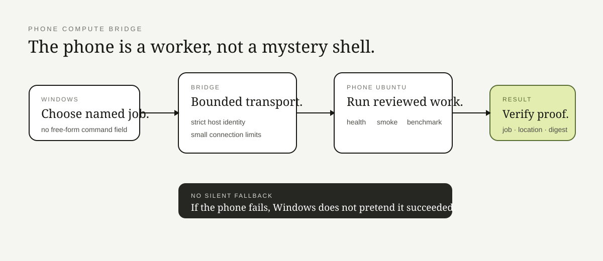

# Ubuntu Phone Compute Bridge

**Yes, the phone is a computer. No, that does not mean every string deserves to become a command.**

This is a sanitized public slice of my Niyam Lab work: a Windows controller sends a small set of named jobs to Ubuntu running on an Android phone, then checks the result before trusting it.

## The shape

**Windows → attended transport → Android/Termux → Ubuntu userspace → named job → structured result**

The interesting part is not “remote execution.” Tools already exist for that.

The interesting part is keeping the bridge boring enough to review:

- jobs come from a fixed registry;
- each job has a small purpose and time budget;
- returned results must identify the job and execution location;
- artifact bytes can be checked against an expected digest;
- remote failure stays a failure instead of quietly becoming a local fallback.

## Repo map

| Area | Responsibility |
|---|---|
| `jobs.py` | named jobs and their limits |
| `results.py` | structured result validation |
| `integrity.py` | artifact digest checks |
| `protocol.py` | stable public facade |
| `windows/` | bounded controller example |
| `tests/` | allowlist, result, and integrity behavior |
| `docs/` | design reasoning |

The private lab contains the actual device setup, recovery notes, and additional experiments. None of those machine-specific details belong in a public proof repo.

Want to verify the boundary instead of admiring the phone? Read the [invariants](docs/invariants.md), [failure modes](docs/failure-modes.md), [job contract](docs/job-contract.md), and [walkthrough](docs/walkthrough.md).

> Tiny computer, normal-sized trust boundary.

## Inspect deeper

- [Design overview](docs/overview.md)
- [Why the design looks this way](docs/decisions.md)
- [Invariants that must survive refactors](docs/invariants.md)
- [How it fails on purpose](docs/failure-modes.md)
- [Security / privacy boundary](SECURITY.md)
- [Where this public slice came from](PROVENANCE.md)

The README is the front door. The interesting arguments are in those files.
