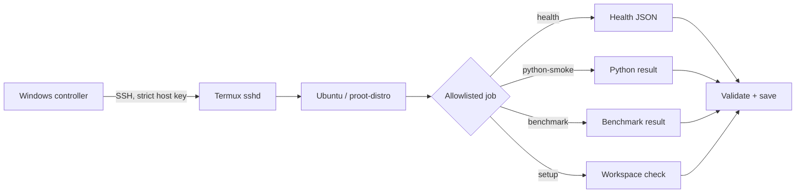

# Ubuntu Phone Compute Bridge

**Yes, the phone is a computer. No, it does not get arbitrary-command privileges.**

This repo is a sanitized public slice of my `niyam-lab` work: a Windows controller that can send only a tiny allowlist of jobs to Ubuntu running inside Termux on Android, then verify what came back.

## Route



There is deliberately no “run arbitrary command” box. That feature is called SSH, and it already exists.

## What this proves

- fixed job allowlist;
- strict host-key checking;
- bounded SSH connection settings;
- no silent Windows fallback when the phone job fails;
- structured result validation;
- SHA-256 integrity helper for returned artifacts;
- explicit execution-location marker.

## Windows example

```powershell
.\windows\Invoke-SafeUbuntuJob.ps1 -Job health -HostAddress 192.0.2.10 -User termux_user -IdentityFile "$HOME\.ssh\phone_lab_ed25519"
```

`192.0.2.10` is an RFC 5737 documentation address. Replace it with your own LAN address.

## Verify locally

```bash
PYTHONPATH=src python -m unittest discover -s tests
```

## Boundary

This repo does not expose a server, open router ports, root Android, ship SSH keys, or accept arbitrary remote commands.

## Provenance

Sanitized and rewritten from the private `niyam-lab` controller. The private project also contains Android/Termux setup, benchmarking, recovery tooling, and additional local experiments.
