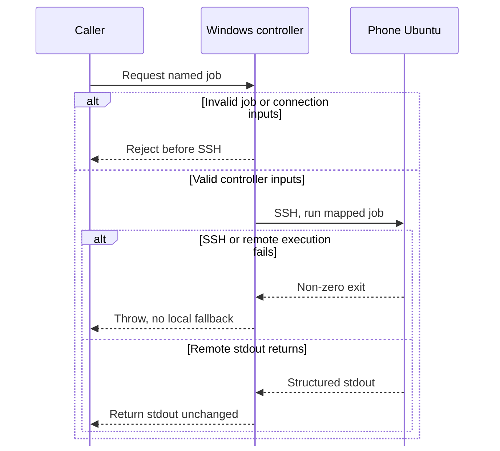
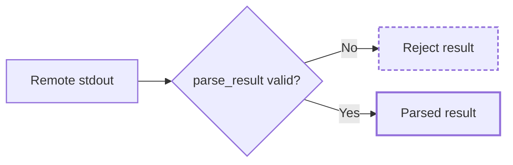
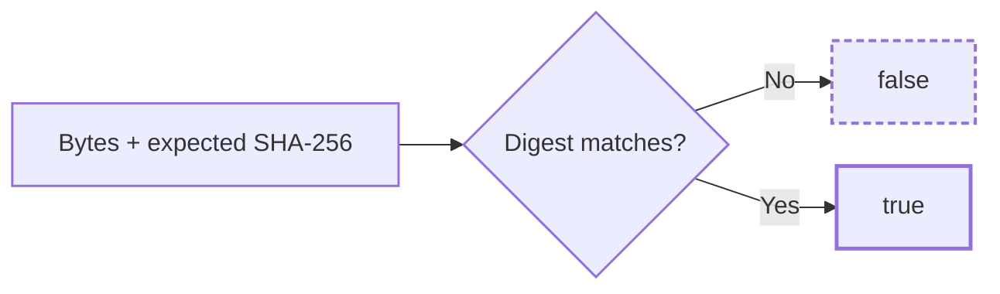

# Ubuntu Phone Compute Bridge

A bounded remote-compute protocol for a Windows controller and a phone-hosted Ubuntu environment: reviewed named jobs, structured results, and optional artifact integrity checks.

**The phone may fail. A victory quietly computed on Windows does not count.**

This public sample comes from my private remote-compute experiments. It exposes the controller and result contract for review. I can build and adapt the surrounding job workflows, device setup, and application integrations; this repo makes no claim that a phone is currently reachable.

## Transport: remote failure stays a failure

## Caller validation: check the result before using it

PowerShell returns stdout. The caller invokes Python validation separately, then verifies artifact bytes when it has an expected digest.

`parse_result()` checks the byte limit, JSON object, expected job, phone execution location, and `ok == true`. Optional artifact verification returns a boolean:

The controller accepts only reviewed named jobs, such as `health`, and uses an explicit SSH host, user, port, identity file, and strict host-key checking. A result can be `{"job":"health","execution_location":"phone-ubuntu","ok":true}`; returning that stdout does not automatically validate it.

## Failure behavior

| Failure | Result |
|---|---|
| unknown job | rejected before transport |
| missing identity file | controller stops before SSH |
| host-key mismatch | SSH refuses the connection |
| SSH / remote non-zero exit | controller throws; there is no local fallback |
| wrong job, wrong execution location, false `ok`, or oversized result | `parse_result(...)` rejects |
| artifact digest mismatch | `verify_artifact(...)` returns false |

## What to inspect

| File | Role |
|---|---|
| `windows/Invoke-SafeUbuntuJob.ps1` | allowlisted Windows controller and explicit SSH boundary |
| `src/compute_bridge/jobs.py` | public named-job registry |
| `src/compute_bridge/results.py` | caller-side structured stdout validation |
| `src/compute_bridge/integrity.py` | optional SHA-256 artifact verification |
| `tests/` | allowlist, result identity/location, failure, size-bound, and digest checks |

## Scope

No SSH key, password, device address, host fingerprint, router configuration, live endpoint, persistent worker service, or claim of a currently reachable phone is included.

Verification commands and expected checks: [docs/verification.md](docs/verification.md)

See [job contract](docs/job-contract.md), [invariants](docs/invariants.md), [failure modes](docs/failure-modes.md), [security boundary](SECURITY.md), and [provenance](PROVENANCE.md).
